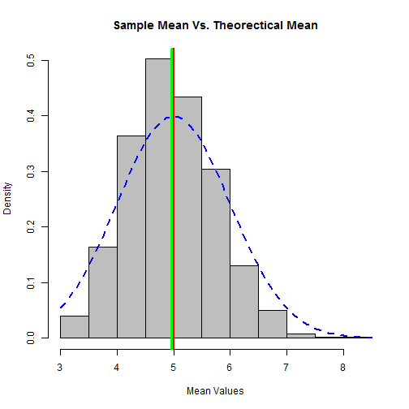
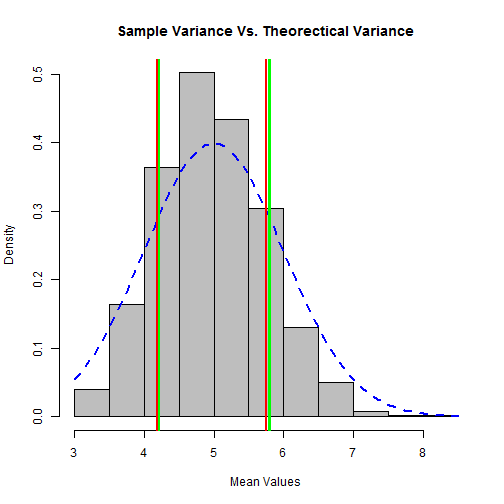
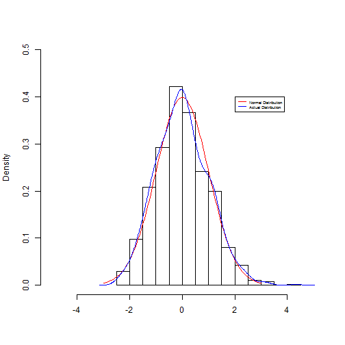
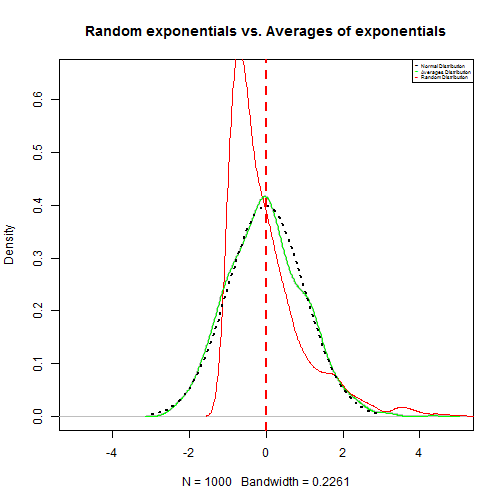

### I. OVERVIEW

Synopsis:
This project investigates the exponential distribution in R and compare it with the Central Limit Theorem. The exponential distribution is simulated with rexp(n, lambda) where lambda is the rate parameter, theoretical mean of exponential distribution is 1/lambda and theoretical standard deviation is also 1/lambda. This project performs a thousand simulations to get the distribution of averages of 40 exponentials, where the lambda is set to 0.2 for all of the simulations. The simulated samples are used to illustrate and explain the following properties of the distribution of the mean of 40 exponentials (a) Relationship between simulated sample mean with theoretical mean (b) Relationship between simulated sample variance with theoretical variance and (c) Distribution is approximately normal.


[Set general options]

```r
# always make code visible
echo = TRUE  
# turn off scientific notations for numbers
options(scipen = 1)  
# set seed for consistent observations
set.seed(12345)
```


### II. SIMULATION

The simulation can be built in R using the rexp(n,l) function, where n is the number of exponentials per set, and l, or lambda is the rate (a constant of these purposes of 0.2).


```r
# Number of simulations
nosim <- 1000
# Sample exponentials
nsam <- 40
# define lambda value
lambda <- 0.2

# The exponential distribution can be simulated in R with rexp(n, lambda) where 
# lambda is the rate parameter.

# create a dataset containing all samples
data <- rexp(nosim*nsam, lambda)

# store it as simulations of thousands(1000) with 40 exponentials in a matrix
mat <- matrix(data, nosim, nsam)

# calculate the sample means
data.mean <- apply(mat, 1, mean)
```


### III. ANALYSIS

1. Show the sample mean and compare it to the theoretical mean of the distribution.

CLT(Central Limit Theorem) tells us that the sample mean is normally distributed with mean equal to the original mean it is trying to estimate and the standard deviation equal to the true variance divided by the number of observations.

(a) Mean of simulated data distribution:

```r
dist.mean <- mean(data.mean)
dist.mean
```

```
## [1] 4.971972
```


(b) Theoretical mean (exponential distribution):

```r
theo.mean <- 1/lambda
theo.mean
```

```
## [1] 5
```

So the theorectical mean of the sample mean is 4.971972 and the calculated mean of the sample mean is 5.000. If we were to simulated infinite data points they should be exactly the same as implied by the CLT. Thus, even with 1000 simulations we can see that they are almost equal.


The plot below depicts this fact with the green vertical line representing the mean of the sample mean that we calculated and the red line representing the therectical mean of the sample mean


```r
hist(data.mean, col="grey", main = "Sample Mean Vs. Theorectical Mean", 
     prob=T , xlab="Mean Values")
curve(dnorm(x,5,1),col="blue",lty=2, lwd=2,add=T)
abline(v = dist.mean, col = "green", lwd = 4)
abline(v=theo.mean, col="red", lwd=2)
```

 


2. Show how variable the sample is (via variance) and compare it to the theoretical variance of the distribution.

(a) Varaiance of simulated data distribution:


```r
dist.variance <- sd(data.mean)^2
dist.variance
```

```
## [1] 0.6157926
```

(b) Theoretical variance (exponential distribution):


```r
theo.variance <- ((1/lambda)^2)/nsam
theo.variance
```

```
## [1] 0.625
```

The theoretical variace of the sample mean is 0.6157926 and the sample variance of the sample mean is 0.625. The results of the theoretical variance as compared to actual variance are very close, as noted above. So, the sample data is 'spread-out' in a similar fashion to what is expected.


```r
hist(data.mean, col="grey", main = "Sample Variance Vs. Theorectical Variance", 
     prob=T, xlab="Mean Values")
curve(dnorm(x,5,1),col="blue",lty=2,lwd=2,add=T)
abline(v =I(theo.mean + c(-1,1)*sqrt(theo.variance)), col = "green", lwd = 3)
abline(v=I(dist.mean + c(-1,1)*sqrt(dist.variance)), col="red", lwd=2)
```

 


3. Show that the distribution is approximately normal.

From the plot given below, a normal curve and overlayed to the sample set along with the actual distribution curve, we can see very clearly that they are very similar. This leads to the conclusion that the sample set can be defined as normal, in terms of distribution.

(a) Comparison of of a nomral distributions vs. distribution of the sample set 

```r
par(mfrow=c(1,1))
hist(scale(data.mean),probability=T,main='',ylim=c(0,0.5), xlim=c(-5,5), xlab='')
curve(dnorm(x,0,1),-3,3, col='red',add=T) # normal distribution
lines(density(scale(data.mean)),col='blue') # actual distribution 
legend(2,0.4,c('Normal Distribution','Actual Distribution'),cex=0.5,col=c('red','blue'),lty=1)
```

 


(b) Focus on the difference between the distribution of a large collection of random exponentials and the distribution of a large collection of averages of 40 exponentials. 


```r
# create a large distribution with 1000 observations
largedist <- rexp(nosim, lambda)

# distribution of a large collection of averages of 40 exponentials, with each set containing 
# 1000 observations. here we re-use the values that we calculated earlier. 
avgsdist <- data.mean
```

Plotting the distributions for comparison 


```r
plot(density(scale(avgsdist)), col="grey", lwd=2, 
     main="Random exponentials vs. Averages of exponentials",ylim=c(0,0.65), xlim=c(-5, 5))
lines(density(scale(largedist)), col="red")
lines(density(scale(avgsdist)), col="green")
curve(dnorm(x,0,1),-3,3, add=T, col="black", lty=3,lwd=2)
abline(v=0, col="red", lty=2, lwd=2)

legend("topright", pch = "_____________",
  legend= c("Normal Distribution", "Averages Distribution", "Random Distribution"), 
  col=c( "black", "green", "red"), cex=0.4)
```

 
  

This distribution of averages of 40 exponentials looks far more Gaussian than the random exponentials
